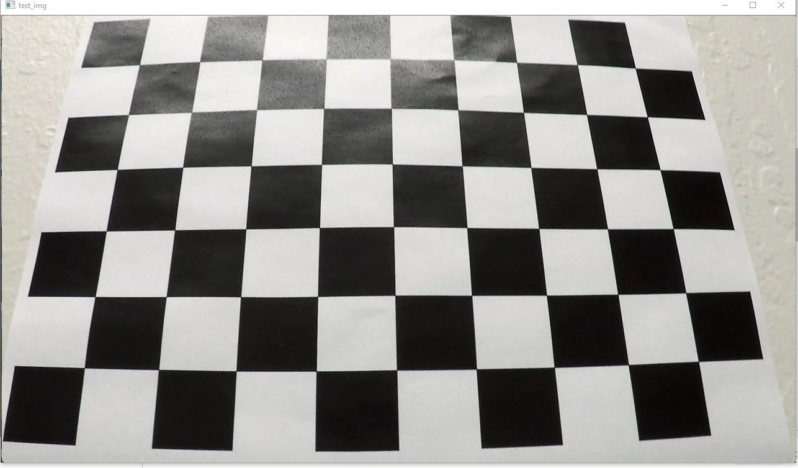
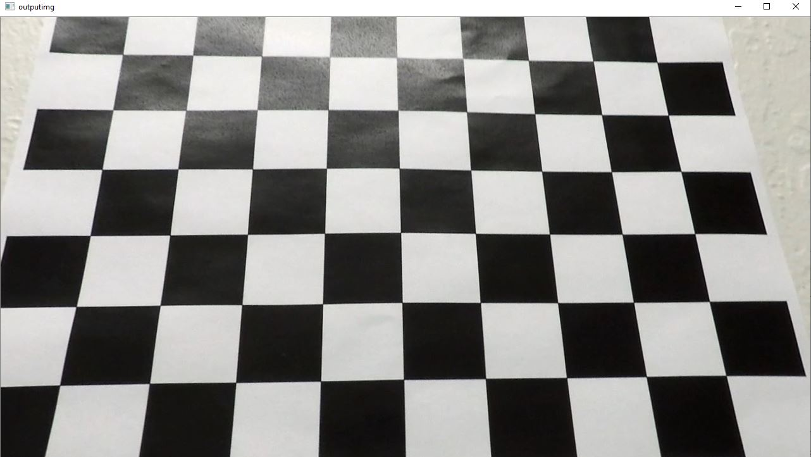
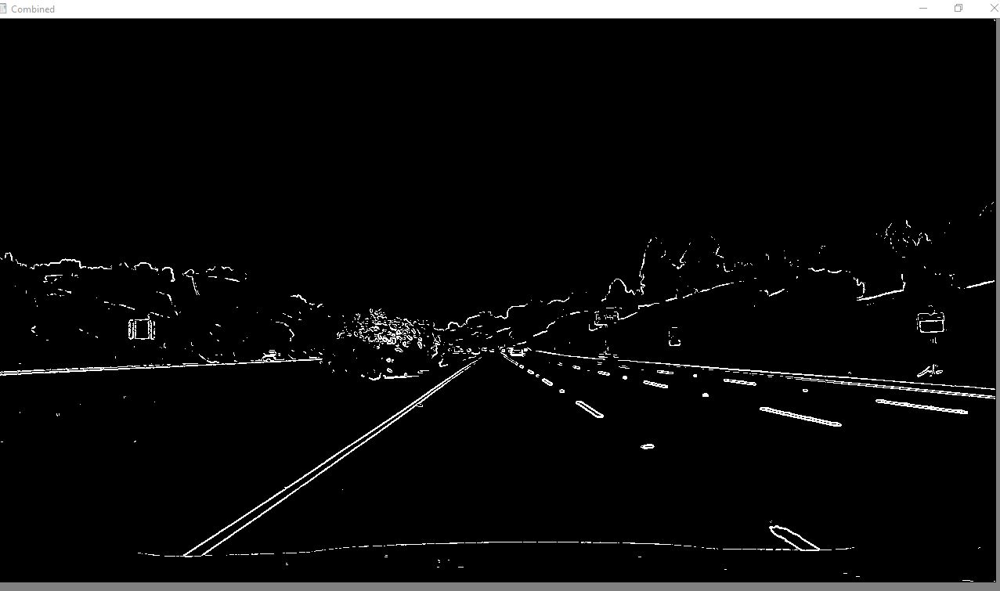
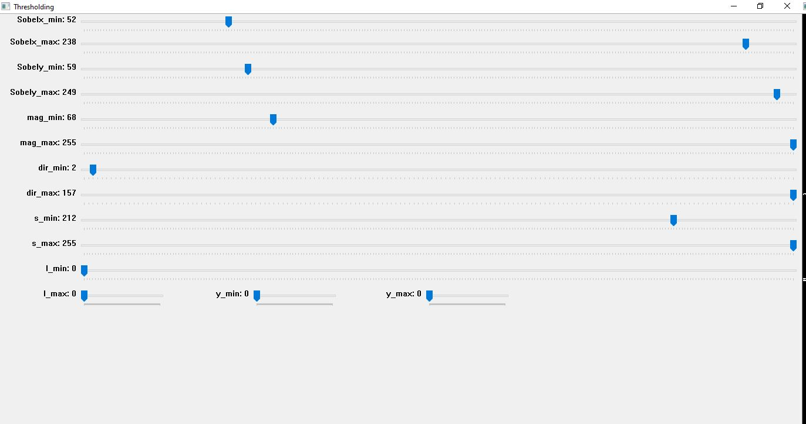
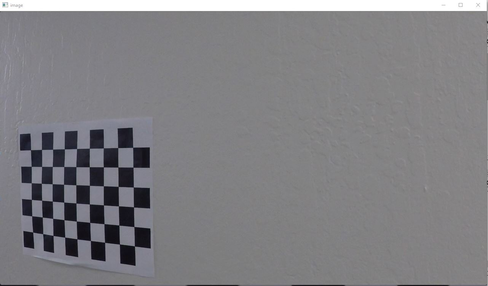
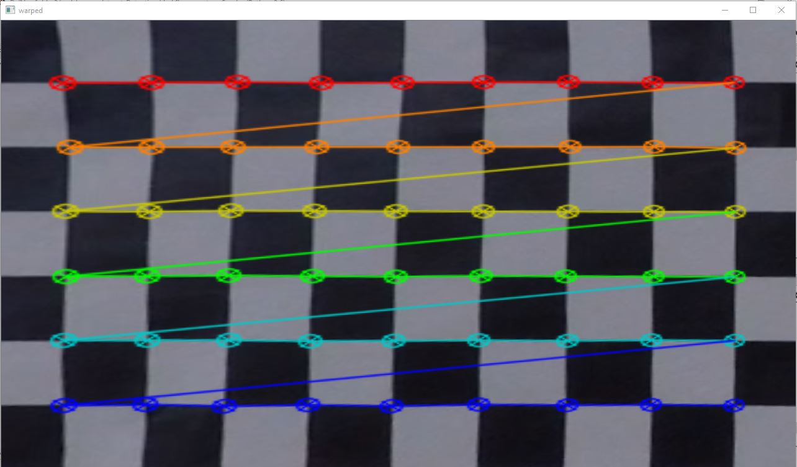
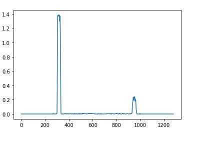
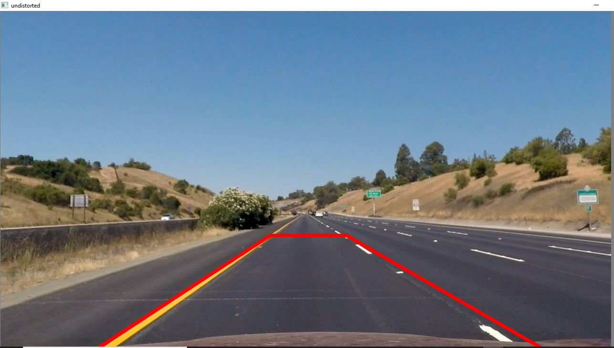
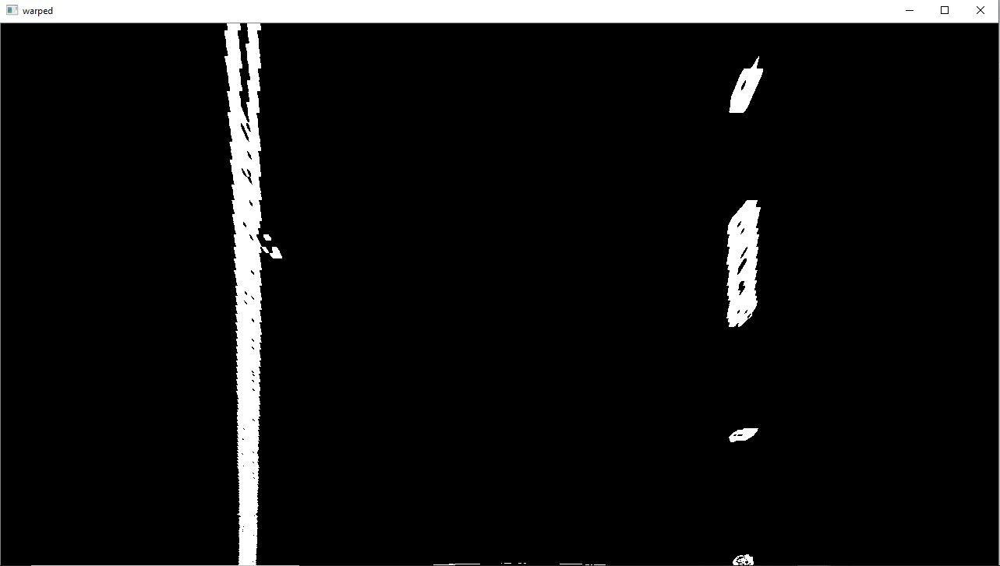
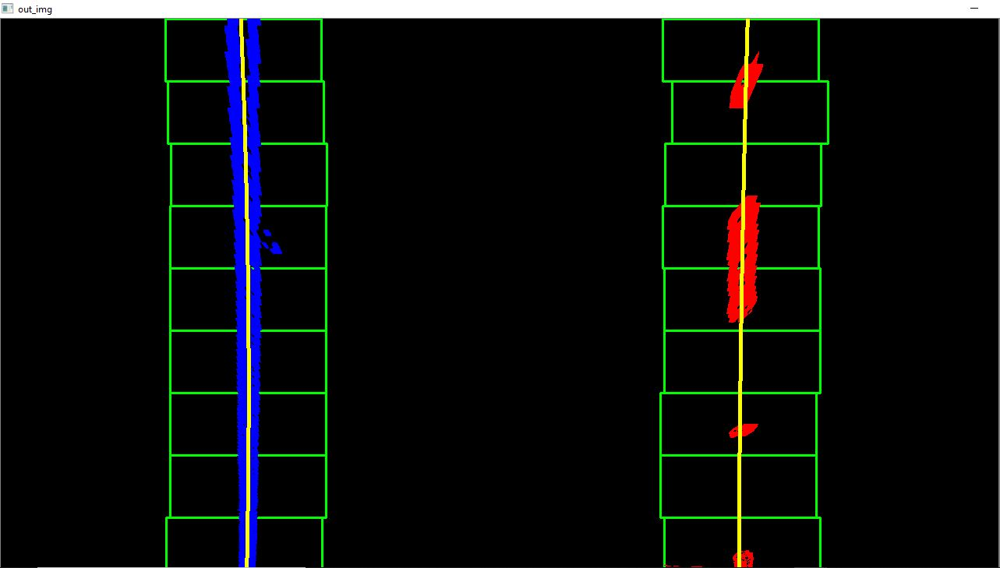

## Advanced Lane Finding


  The project is an advanced version of the previous lane detection algorithm which uses canny edges and hough transformt to detect lanes. The problem with the previous algotihm is that it fails to detect lanes of different curvature and lighting. This project makes is broken down into many steps to solve the lane detection problem. The general idea behind the project is that we first perform the lens correction, then we find out the lanes using sobel opration and color spaces thresholding. Now after getting a binary warped image we then make a perspective transform which is the bird's eye view of the road. Now we fit a second order polynomial to get the lane boundaries and mark the region inside the lane which is safe for the car to travel. We also find out the radius of curvature.
  

 
<h3> Camera Calibration </h3>

<p> We  use around 20 images to correct the distortion in our camera lenses. This distortion usually results in extension of lanes or shifitng of lines from desired position. So we need to calibrate camera to correct it before further processing. 
  We find the corners of the chessboard image. A corner is the intersection of 4 sqaures. The image has 9X6 corners in total. We generate the total corners and compare it with the detected corners to find out the camera matrix and distortion coefficient. </p>

```
//Move to the project directory.
Run project.py
The output matrices are stored in ./camera_cal/matrix.p

```
<h4> Distorted image </h4>



<h4> Undistorted image after calibration </h4>



<p> We can see that there is a bulging effect at the bottom of the undistorted image which is being corrected by calibration of camera lenses </p>

<h3> Color and Gradient Thresholding </h3>

```
//Goto the project directory
Run color_gradient_threshold.py for tuning the threshold for vaious techniques.
Run hlsandgradfinalthresholding.py for complete version of the pipeline for thresholding and use the threshold values from previous tuning

```
<p> We apply various thresholding to image to detect only lanes. The Sobel operator which finds the corners is first performed along x axis, then along y axis. We then take the magnitude and direction of both x and y of the sobel operator. The threshold values are chosen based on experiment using the color_gradient_threshold.py. Now we apply color thresholding to the image to get finer distinction. The image is converted to HLS format and a threshold is selected for saturation. The final image is obtained by below combination of the various thresholding</p>

```
combined[((gradx == 1) & (grady == 1)) | ((mag_binary == 1) & (dir_binary == 1)) |(s_binary == 1)] = 1

```




<h3> Perspective Transform </h3>

<p> To detect the curvature of the a line we cannot directly determine with the image from the camera. These images may appear curved even when they are lot for points in long distance from camera. So we use a perspective transform to solve this. We get a bird's eye view of the image after the transform. We test the transformtion using the same chess board image. But this time the object is away from the center of the image. The perspective warps this and brings the image to the center. We also use Bilinear interpolation to to fill up the areas while transforming </p>

```
Goto project directory
Run prespectvetransform.py
```
<h4> Image where object is facing different angle and not camera </h4>


<h4> Perspective transform output </h4>


<h3> Final Pipeline </h3>

```
Go to project directory
For detecting lanes in images
Run Pipeline_for_images.py
For detecting lanes in videos
Run Pipeline_for_videos.py

The output is stored in ./output_images

```

<p> We combine all the techniques and detect lanes in the videos . We read the image and set the kernel size as 3 for all the gradient thresholding. The image is undistorted using the camera matrix and distortion coefficients in ./camera_cal/matrix.p pickle file. The sobel along x & y is performed. Then magnitude and gradient is computed. Finally the image is converted to HLS and Saturation values are adjusted. All these are combined to get the final image. </p>

<h5> Perspective transform and Polynomial Fitting </h5>

<p> The trapezoidal region of the warped image is chosen as the source. The sources covers the left and right lanes with slight margin to fit for different images. Destination points are chosen to transform the source points to a rectangular region in the transformed image</p>

<p>Now we fit a second polynomial for the lanes. The histogram of the image is taken at the bottom half of the image. The magnitude of the histogram at the lanes is very high and so we choose that as the point of start </p>

<h6> Histogram image </h6>



<p> We use sliding window to find out the lanes along y direction since x direction lanes don't change much we fit a polynomial for y direction. We move the sliding window in y direction and find out the maximum in the left half and right half of the histogram for each window. A selected margin is used to make a box around the lane. If the box has more lane pixels than minimum pixel we then recenter the box along x for the next window. After that select the corrseponding left lane and right lanes x,y coordinates. Now we use the polyfit function to detect both lanes in the image.(y=a*x^2+b*x+c) </p>

<h6> Source points in the image for perspective transform </h6>



<h6> Perspective transform of road </h6>



<h6> polynomial fitting </h6>




<h5> Measuring the radius of curvature </h5>


The radius of curvature measure here is based on pixel value. To convert to real word numbers we need to do some conversion. The lane is about 30 meters long and 3.7 meters wide. Or, if you prefer to derive a conversion from pixel space to world space in your own images, compare your images with U.S. regulations that require a minimum lane width of 12 feet or 3.7 meters, and the dashed lane lines are 10 feet or 3 meters long each.

Let's say that our camera image has 720 relevant pixels in the y-dimension, and we'll say roughly 700 relevant pixels in the x-dimension between 2 lanes from histogram. Therefore, to convert from pixels to real-world meter measurements, we can use:

# Define conversions in x and y from pixels space to meters
ym_per_pix = 30/720 # meters per pixel in y dimension
xm_per_pix = 3.7/700 # meters per pixel in x dimension


<h5> Adjustment for video </h5> 

<p> Finally for a video we need to perform all the calculation for each frame. Since finding the lanes takes much time, we can make a margin around the previoulsy detected lanes and serach for lanes pixelx from there alone. We can also introduce a count variable and perform the lane detection from complete image after certain steps of the video. This helps to solve an miscalculation and wrong lane detection which might occur while searching in the margin of previous lane alone, if the previous lane is wrongly detected, the error may accumulate. So we recalculate the lanes after certain time frames again. </p>

